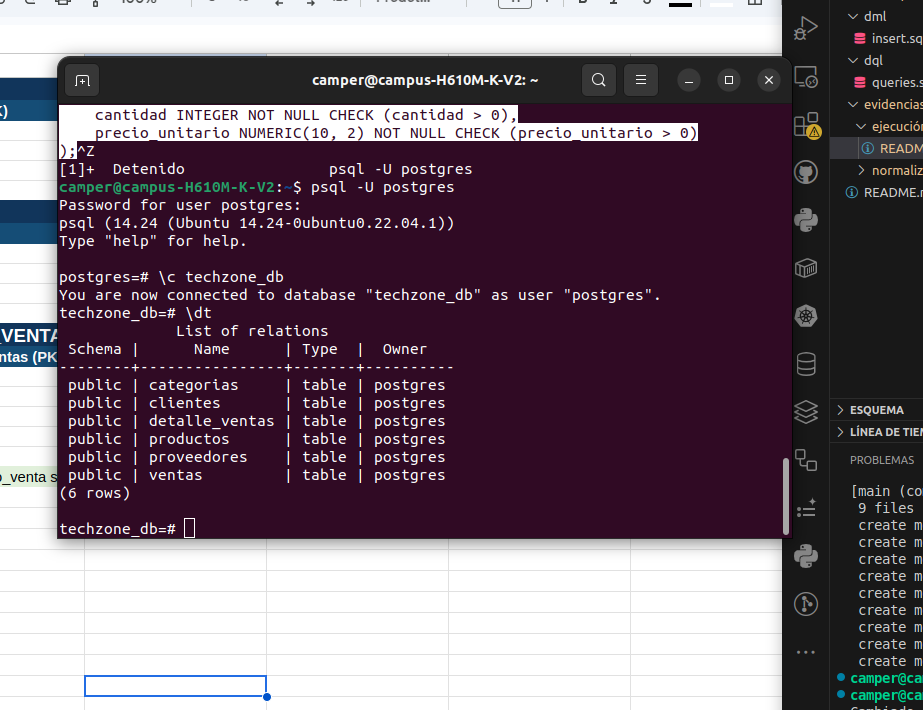
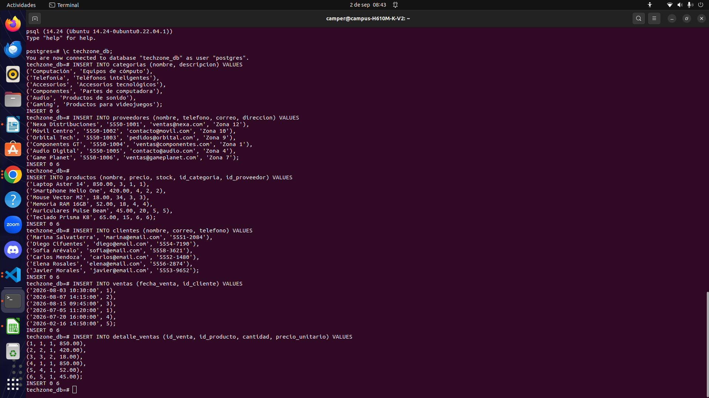

## # adjunto evidencias de ejecución y proceso de pruebas 

## numero 1  creación de la base de dato e inserccion de tablas 

se crearon las tablas segun el modelo entidad relación para ejecutar desde la base de datos con los siguientes comandos 
\c techzone_db

## numero 2 inserccion de los datos en cata tabla
se insertaron los datos correctamente para ejecutar posteriormente en la terminal las insercciones 

## numero 3 se probaron las consultas 

## numero 4 procedure
se probo el procedimiento y queries de acuerdo al caso de negocio y las automatizaciones que necesitaba la empresa sin usar transacciones 

git add dml/insert.sql
git commit -m "feat: insertar datos de prueba"
git switch -c feature/queries